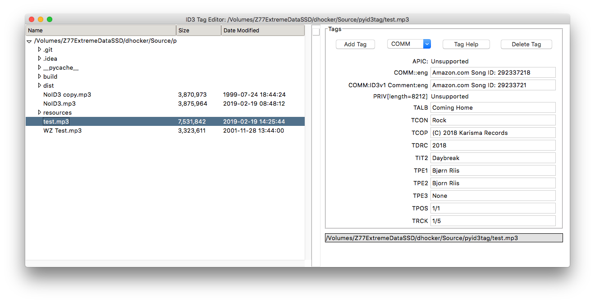

#  pyid3tag - Basic ID3 Tag Editor
Copyright © 2019 by Dave Hocker

## Contents
* [Overview](#overview)
* [Running the App](#running-the-app)
* [User Interface](#user-interface)
* [References](#references)

## Overview
This app is a very basic ID3 tag editor for mp3 files. It is written in Python 3 
using TkInter and
should run of Windows, Linux or macOS X. For macOS X, there is an app (pyid3tag.app).
For other OSes, it can be run from the source.

## License

This app is licensed under the GNU General Public License v3 as published 
by the Free Software Foundation, Inc..
See the LICENSE file for the full text of the license.

## Running the App
### macOS X
The release includes a .zip file with pyid3tag.app. You can unzip it and copy the
pyid3tag.app file to the Applications folder. From there, you can run it using normal
macOS methods. For example, you can open a Finder window, go to Applications and double
click on the app file. Or, you can use LaunchPad.

### From Source
#### Requirements
You can use a virtual environment (hightly recommended) or you can install the 
requirements to the system Python 3. Virtual environments is out of the scope of
this discussion, but you can find out more from the [references](#references).

    cd pyid3tag
    pip install -r requirements.txt

Using this technique, you can run the app from its souce directory.

    cd pyid3tag
    python3 id3tag.py

## User Interface

### Panes
The application features two panes: the file list tree and the tags list. 
* Use the File/Open directory menu item to select a directory into the file list 
tree.
* Use the File/Edit file menu item to load the ID3 tags of a file into the tags list pane. 
Or, simply double click the file. 
* After editing ID3 tags, use the File/Save file menu item to save the changes.

### Menu Items

#### File
* Open directory - Use this item to open a directory in the file list tree.
* Edit file - Load the selected file's ID3 tags into the tags widget.
* Save file - Save edited ID3 tags back into its file.

#### Help
* About pyid3tag - typical about dialog box with license information. Note
that under macOS X this menu item is under the id3tag or python menu item.
* Application - Opens the README.md file (this file) in the default web browser.
* Tags - Opens the Tag Help window next to the application window. The Tag Help
window 

### Tags Widget Buttons
* Add Tag - Adds a new tag to the set of ID3 tags.
* Tag combo box - Selects the tag to be added.
* Tag Help - Opens the Tag Help window next to the application window.
* Delete Tag - Deletes the currently selected tag (this is the tag containing the cursor).

## References 
* [virtualenv on pypi](https://virtualenv.pypa.io/en/latest/)
* [virtualenvwrapper read-the-docs](https://virtualenvwrapper.readthedocs.io/en/latest/)
* [Wikipedia ID3](https://en.wikipedia.org/wiki/ID3)
* [ID3.org ID3v2 frames](http://id3.org/id3v2.3.0#Declared_ID3v2_frames)